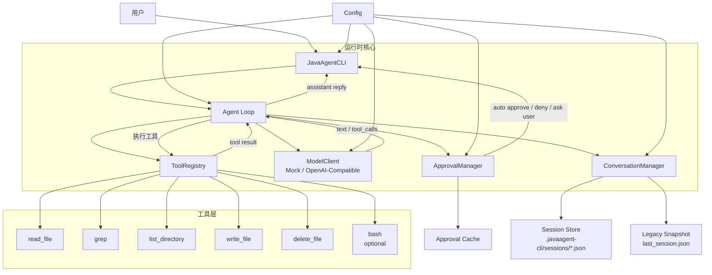
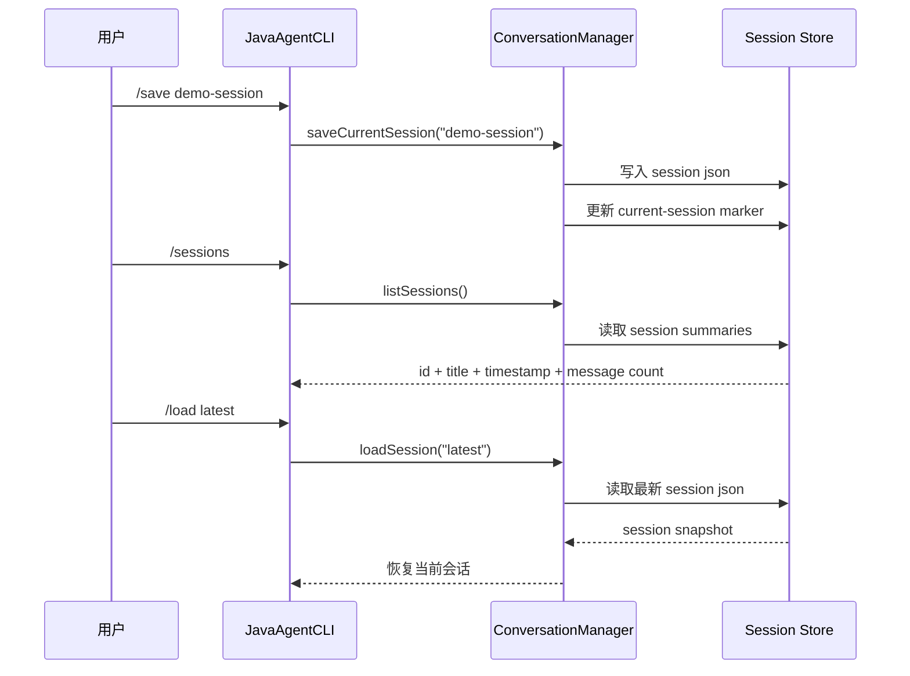

# JavaAgent CLI 架构报告

## 1. 项目定位

JavaAgent CLI 是是用一个可运行、可测试、可答辩的小项目展示工具调用的核心链路：

- 用户输入自然语言
- 模型决定是否发起 tool call
- 本地工具执行任务
- 工具结果回灌给模型
- 模型基于上下文生成最终回答
- 敏感操作必须经过审批
- 会话可以保存和恢复

课堂主线使用 mock 模式，保证演示稳定；real 模式作为加分项，证明同一套架构可以接入 OpenAI-compatible 服务，默认模型为 `gpt-5.4-mini`。

## 2. 总体架构



核心类职责：

- `JavaAgentCLI`：命令行入口，处理 `/help`、`/status`、`/mode` 等命令。
- `Agent`：同步 agent loop，负责模型调用、工具执行、结果回灌。
- `ModelClient`：模型客户端接口，当前有 mock 和 OpenAI-compatible 两种实现。
- `ToolRegistry`：注册和查找工具。
- `ApprovalManager`：审批策略、路径策略、审批缓存。
- `ConversationManager`：上下文和多会话持久化。
- `Config`：配置加载和默认值管理。

## 3. 主运行流程

1. 用户在 CLI 输入请求。
2. `JavaAgentCLI` 把请求交给 `Agent.processTurn`。
3. `Agent` 构建 system prompt，并把历史上下文、工具定义传给 `ModelClient`。
4. `ModelClient` 返回普通文本或 `tool_calls`。
5. 如果是普通文本，直接输出并保存到会话。
6. 如果是 `tool_calls`：
   - `ToolRegistry` 查找工具。
   - `ApprovalManager` 判断是否自动通过、拒绝或请求用户审批。
   - 工具执行后返回 `ToolExecutionResult`。
   - 工具结果作为 tool message 加入上下文。
7. `Agent` 再次调用模型，让模型基于工具结果生成最终回答。
8. `ConversationManager` 自动保存当前会话。

这个流程是同步的，适合课堂讲解，也方便单元测试覆盖。

## 4. 工具层设计

默认工具：

- `read_file`：读取文本文件，自动通过。
- `grep`：正则搜索文本，自动通过。
- `list_directory`：列目录，自动通过。
- `write_file`：写入或追加文本，需要审批。
- `delete_file`：删除普通文件，需要审批。

可选工具：

- `bash`：执行 shell 命令，默认关闭，开启后也始终需要审批。

工具抽象统一包含：

- name
- description
- parameter schema
- aliases
- readOnly / destructive 标记
- execute 方法

这样模型只需要看到工具定义，Agent 只需要按统一接口执行工具。

## 5. 权限和审批规则

### 自动通过

- `read_file`
- `grep`
- `list_directory`

### 需要审批

- `write_file`
- `delete_file`
- `bash`

### 直接拒绝

- bash 未启用时调用 `bash`
- 访问 workspace 外路径，且 `allowExternalPaths=false`
- 修改 `.git`、`.javaagent-cli`、配置文件或 session 内部状态
- 删除 workspace 根目录
- 删除目录
- 覆盖二进制文件

### 审批缓存

相同危险操作会复用之前的审批结果，减少重复确认。可以用下面命令清空：

```text
/approvals clear
```

## 6. 会话持久化

会话相关能力：

- `/save [title]` 保存当前会话
- `/sessions` 列出历史会话
- `/load [id|title|latest]` 加载会话
- `/clear` 或 `/new [title]` 开启新会话

存储位置：

- `.javaagent-cli/sessions/*.json`：多会话存储
- `.javaagent-cli/current-session.txt`：当前会话标记
- `last_session.json`：兼容旧版本的快照



## 7. Mock 模式和 Real 模式

### Mock 模式

mock 模式是课堂主线，优点是：

- 不依赖网络
- 不依赖 API key
- 输出稳定
- 方便演示工具调用
- 方便做单元测试

mock 客户端会根据中文或英文关键词选择工具，例如“读取”“搜索”“列出”“写入”“删除”。

### Real 模式

real 模式使用 `OpenAiCompatibleModelClient`，请求：

```text
{base_url}/chat/completions
```

当前默认模型：

```text
gpt-5.4-mini
```

real 模式可以证明模型客户端是可替换的，但它依赖网络、API key、代理服务和额度，所以只作为加分展示。

## 8. 为什么这个设计适合课程项目

- 体量小，能在一页架构图讲清楚。
- 链路完整，能展示真实 agent 工作流。
- 有安全边界，危险操作不是直接执行。
- 有 mock 模式，课堂演示稳定。
- 有 real 模式，可证明架构不是纯模拟。
- 有会话持久化，体现状态管理。
- 有 Maven 打包，可以交付可执行 jar。
- 有单元测试，能证明工程质量。

## 9. 当前边界

这个项目有意保持课堂级复杂度，不做过度设计：

- real 模式不是生产级高可用客户端，没有重试、限流和详细 tracing。
- `/stream on` 是控制台文本分块输出，不是真正 HTTP SSE。
- bash 默认关闭，不作为主线演示能力。
- 文件工具只面向安全的文本文件演示，不处理大文件或复杂二进制。

这些边界是为了保证项目小、清晰、可解释。

## 10. 答辩关键词

- synchronous agent loop
- tool calling
- tool-result feedback
- approval gate
- workspace-first permission policy
- approval cache
- multi-session persistence
- mock / real model switching
- OpenAI-compatible API
- pure Java implementation
- executable fat jar
- unit tests
